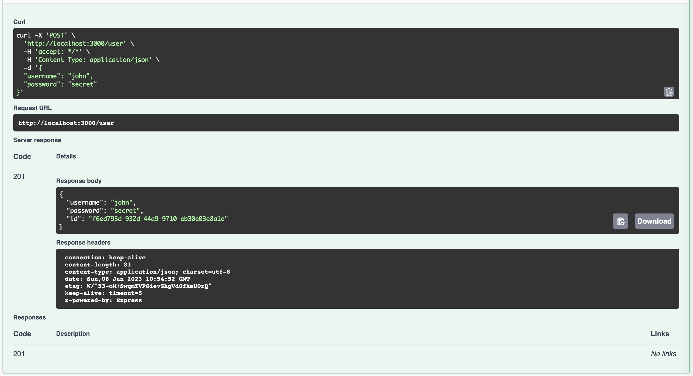

> You can find the source-code of this article here: [https://github.com/ynwd/nest-init/tree/postgres](https://github.com/ynwd/nest-init/tree/postgres)

Install typeorm and postgres package
```bash
$ npm i typeorm pg
```

Create database module
```bash
$ nest g mo database
```

Create database provider (src/database/database.providers.ts)
```ts
import { DataSource } from 'typeorm';

export const databaseProviders = [
  {
    provide: 'DATA_SOURCE',
    useFactory: async () => {
      const dataSource = new DataSource({
        type: 'postgres',
        host: 'localhost',
        port: 5432,
        username: 'postgres',
        password: 'root',
        database: 'test',
        entities: [__dirname + '/../**/*.entity{.ts,.js}'],
        synchronize: true,
      });

      return dataSource.initialize();
    },
  },
];

```

Attach above databaseProviders to DatabaseModule (src/database/database.module.ts)
```ts
import { Module } from '@nestjs/common';
import { databaseProviders } from './database.providers';

@Module({
  providers: [...databaseProviders],
  exports: [...databaseProviders],
})
export class DatabaseModule {}

```

## Setup user table

Update user entity (src/modules/user/entities/user.entity.ts)
```ts
import { Entity, Column, PrimaryGeneratedColumn } from 'typeorm';

@Entity()
export class User {
  @PrimaryGeneratedColumn('uuid')
  id: string;
  @Column({ length: 36 })
  username: string;
  @Column()
  password: string;
}

```

Create userProviders (src/modules/user/user.provider.ts)
```ts
import { DataSource } from 'typeorm';
import { User } from './entities/user.entity';

export const userProviders = [
  {
    provide: 'USER_REPOSITORY',
    useFactory: (dataSource: DataSource) => dataSource.getRepository(User),
    inject: ['DATA_SOURCE'],
  },
];

```

Attach DatabaseModule and userProviders to UserModule (src/modules/user/user.module.ts)
```ts
import { Module } from '@nestjs/common';
import { UserService } from './user.service';
import { UserController } from './user.controller';
import { userProviders } from './user.provider';
import { DatabaseModule } from 'src/database/database.module';

@Module({
  imports: [DatabaseModule],
  controllers: [UserController],
  providers: [UserService, ...userProviders],
})
export class UserModule {}

```

Inject user repository to user service (src/modules/user/user.service.ts)
```ts
import { Inject, Injectable } from '@nestjs/common';
import { Repository } from 'typeorm';
import { CreateUserDto } from './dto/create-user.dto';
import { UpdateUserDto } from './dto/update-user.dto';
import { User } from './entities/user.entity';

@Injectable()
export class UserService {
  constructor(
    @Inject('USER_REPOSITORY')
    private repo: Repository<User>,
  ) {}

  async create(createUserDto: CreateUserDto) {
    return this.repo.save(createUserDto);
  }

  async findAll() {
    return await this.repo.find();
  }

  async findOne(id: string) {
    return await this.repo.findOneBy({ id });
  }

  async update(id: string, updateUserDto: UpdateUserDto) {
    return await this.repo.update(id, updateUserDto);
  }

  async remove(id: string) {
    return await this.repo.delete(id);
  }
}

```

Call user service from user controller (src/modules/user/user.controller.ts)
```ts
import {
  Controller,
  Get,
  Post,
  Body,
  Patch,
  Param,
  Delete,
} from '@nestjs/common';
import { UserService } from './user.service';
import { CreateUserDto } from './dto/create-user.dto';
import { UpdateUserDto } from './dto/update-user.dto';

@Controller('user')
export class UserController {
  constructor(private readonly userService: UserService) {}

  @Post()
  async create(@Body() createUserDto: CreateUserDto) {
    return await this.userService.create(createUserDto);
  }

  @Get()
  async findAll() {
    return await this.userService.findAll();
  }

  @Get(':id')
  async findOne(@Param('id') id: string) {
    return await this.userService.findOne(id);
  }

  @Patch(':id')
  async update(@Param('id') id: string, @Body() updateUserDto: UpdateUserDto) {
    return await this.userService.update(id, updateUserDto);
  }

  @Delete(':id')
  async remove(@Param('id') id: string) {
    return await this.userService.remove(id);
  }
}

```

Dont forget to update create user dto (src/modules/user/dto/create-user.dto.ts)
```ts
import { ApiProperty } from '@nestjs/swagger';

export class CreateUserDto {
  @ApiProperty({ default: 'john' })
  username: string;
  @ApiProperty({ default: 'secret' })
  password: string;
}
```

Update edit user dto (src/modules/user/dto/update-user.dto.ts)
```ts
import { ApiProperty } from '@nestjs/swagger';

export class UpdateUserDto {
  @ApiProperty({ default: 'john' })
  username: string;
  @ApiProperty({ default: 's3cr3t' })
  password: string;
}

```

Run database
```
$ docker-compose up
```

Run the server
```
$ nest start -w
```

Open the api docs (http://localhost:3000/api) and try to hit all endpoint.