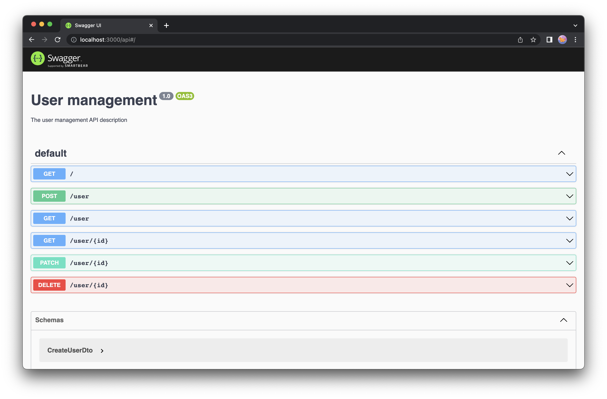

> You can find the source code of this article here: https://github.com/ynwd/nest-init/tree/swagger

After creating CRUD resources endpoint, you can try them directly with Swagger.

```bash
# install swagger package
$ npm install --save @nestjs/swagger
```

After installation complete, edit `main.ts`.
```ts
import { NestFactory } from '@nestjs/core';
import { SwaggerModule, DocumentBuilder } from '@nestjs/swagger';
import { AppModule } from './app.module';

async function bootstrap() {
  const app = await NestFactory.create(AppModule);

  const config = new DocumentBuilder()
    .setTitle('User management')
    .setDescription('The user management API description')
    .setVersion('1.0')
    .build();
  const document = SwaggerModule.createDocument(app, config);
  SwaggerModule.setup('api', app, document);

  await app.listen(3000);
}
bootstrap();
```

Run the server:

```bash
$ npm run start:dev
```

All endpoint initial endpoint docs will be available at [http://localhost:3000/api](http://localhost:3000/api).

